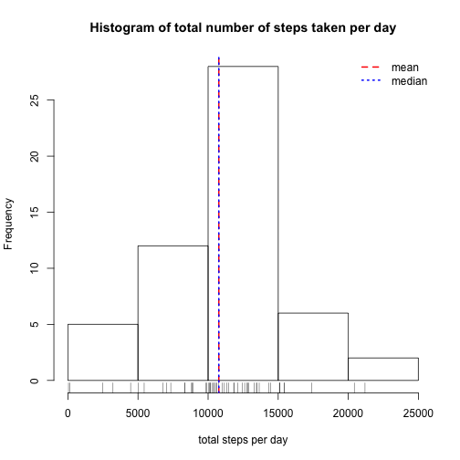
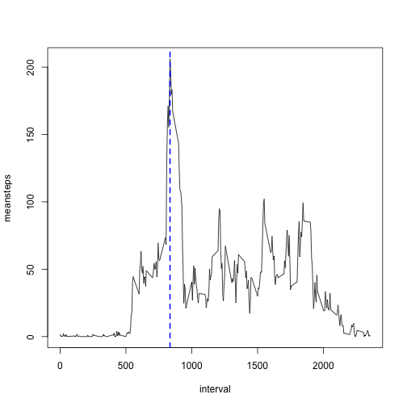
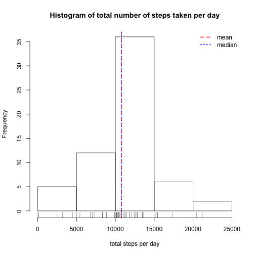

## Loading and preprocessing the data

> 1. Load the data (i.e. `read.csv()`)


```r
if (!file.exists("activity.zip")) {
    download.file("https://d396qusza40orc.cloudfront.net/repdata%2Fdata%2Factivity.zip", "activity.zip")
}
if (!file.exists("activity.csv")) {
    unzip("activity.zip", "activity.csv")
}
data <- read.csv("activity.csv", colClasses = c("numeric", "Date", "integer"))
```

> 2. Process/transform the data (if necessary) into a format suitable for your analysis


```r
# data with filtered NA step values
library(dplyr)
data.nona <- data %>% filter(!is.na(steps))
```

## What is mean total number of steps taken per day?

> 1. Calculate the total number of steps taken per day


```r
perDay <- data.nona %>% group_by(date) %>% summarise(totalsteps = sum(steps))
```

> 2. Make a histogram of the total number of steps taken each day
> 3. Calculate and report the mean and median of the total number of steps taken per day


```r
hist(perDay$totalsteps, 
     main = "Histogram of total number of steps taken per day", 
     xlab = "total steps per day")
rug(perDay$totalsteps)
meantotal <- mean(perDay$totalsteps)
mediantotal <- median(perDay$totalsteps)
abline(v = meantotal, col = "red", lwd = 2, lty = 2)
abline(v = mediantotal, col = "blue", lwd = 2, lty = 3)
legend("topright", 
       c("mean", "median"), 
       bty = "n",
       lty = c(2, 3), 
       lwd = 2, 
       col = c("red", "blue"))
```

 

* The **mean** total number of steps taken per day is 10766.19 steps.
* The **median** total number of steps taken per day is 10765 steps.

## What is the average daily activity pattern?

> 1. Make a time series plot (i.e. `type = "l"`) of the 5-minute interval (x-axis) and the average number of steps taken, averaged across all days (y-axis)
> 2. Which 5-minute interval, on average across all the days in the dataset, contains the maximum number of steps?


```r
perInterval <- data.nona %>% group_by(interval) %>% summarise(meansteps = mean(steps))
with(perInterval, plot(interval, meansteps, type = "l"))
maxStepsInterval <- perInterval$interval[which.max(perInterval$meansteps)]
abline(v = maxStepsInterval, lwd = 2, lty = 2, col = "blue")
```

 

On average it's 835 interval that contains the maximum number of steps across all the days in the dataset.

## Imputing missing values

> 1. Calculate and report the total number of missing values in the dataset (i.e. the total number of rows with NAs)


```r
data %>% group_by(is.na(steps)) %>% summarise(total.count = n())
```

```
## Source: local data frame [2 x 2]
## 
##   is.na(steps) total.count
##          (lgl)       (int)
## 1        FALSE       15264
## 2         TRUE        2304
```

> 2. Devise a strategy for filling in all of the missing values in the dataset. The strategy does not need to be sophisticated. For example, you could use the mean/median for that day, or the mean for that 5-minute interval, etc.

I will use the means for the 5-minute intervals as fillers for missing values.

> 3. Create a new dataset that is equal to the original dataset but with the missing data filled in.


```r
noNA <- function(a, b) {
    if (is.na(a)) {
        b
    } else {
        a
    }
}
data.filled <- data %>% left_join(perInterval, by = "interval") %>% transmute(
    steps = mapply(noNA, steps, meansteps),
    date = date,
    interval = interval)
```

> 4. Make a histogram of the total number of steps taken each day and Calculate and report the mean and median total number of steps taken per day. Do these values differ from the estimates from the first part of the assignment? What is the impact of imputing missing data on the estimates of the total daily number of steps?


```r
perDay <- data.filled %>% group_by(date) %>% summarise(totalsteps = sum(steps))
hist(perDay$totalsteps, 
     main = "Histogram of total number of steps taken per day", 
     xlab = "total steps per day")
rug(perDay$totalsteps)
meantotal <- mean(perDay$totalsteps)
mediantotal <- median(perDay$totalsteps)
abline(v = meantotal, col = "red", lwd = 2, lty = 2)
abline(v = mediantotal, col = "blue", lwd = 2, lty = 3)
legend("topright", 
       c("mean", "median"), 
       bty = "n",
       lty = c(2, 3), 
       lwd = 2, 
       col = c("red", "blue"))
```

 

* The **mean** total number of steps taken per day is 10766.19 steps.
* The **median** total number of steps taken per day is 10766.19 steps.

*The only difference to estimates from the first part of assignment is that mean is equal to median now.*

## Are there differences in activity patterns between weekdays and weekends?

> 1. Create a new factor variable in the dataset with two levels – “weekday” and “weekend” indicating whether a given date is a weekday or weekend day.


```r
data.filled$daytype <- factor(weekdays(data.filled$date) %in% c("Saturday", "Sunday"),
                              labels = c("weekday", "weekend"))
```

> 2. Make a panel plot containing a time series plot (i.e. type = "l") of the 5-minute interval (x-axis) and the average number of steps taken, averaged across all weekday days or weekend days (y-axis).


```r
library(lattice)
xyplot(meansteps ~ interval | daytype,
       data = data.filled %>% group_by(interval, daytype) %>% summarise(meansteps = mean(steps)),
       type = "l", 
       layout = c(1, 2), 
       xlab = "Interval", 
       ylab = "Number of steps")
```

 
